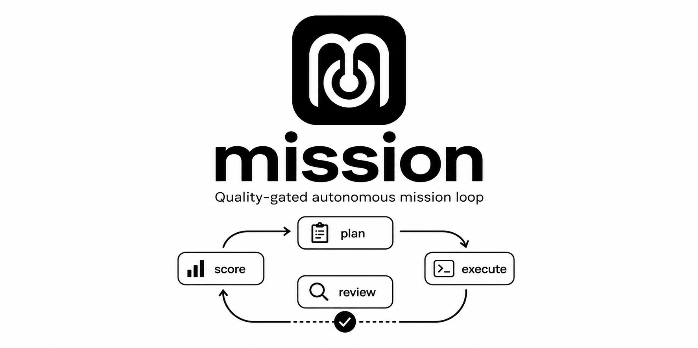

# mission

<p align="center">
  
</p>


**English** | [Japanese](README.ja.md)

`mission` is an OSS loop-engineering plugin for Claude Code and Codex. It keeps
agentic work moving until a recorded plan, reviewer evidence, aggregated score,
and state gate say the mission is actually done.

It plans, executes, collects `mission-review/1` reviewer output, aggregates that
review evidence into `push-score --scoring-json`, and iterates until the
configured threshold is reached. A Stop hook keeps the loop from ending early
while an active mission is still below the passing gate.

> Prompt engineering tells an agent what to do. Loop engineering defines how the
> agent keeps working until the job is actually done.

Use `mission` when the problem is not "what prompt should I write?" but "how do I
stop an agent from declaring success before the work passes a quality gate?"

## Loop Engineering

`mission` is a quality-gated loop for multi-step agent work:

```text
plan -> execute -> review -> aggregate score -> iterate
```

It is designed for the loop-engineering moment: recurring agent systems,
workflows, skills, plugins, and sub-agents are becoming the unit of leverage, but
a loop still needs a deterministic way to decide when it may stop. `mission`
provides that completion gate with `.mission-state`, reviewer JSON,
`aggregate-reviews`, findings evidence, and threshold-based pass/fail state.

For public launch positioning, GitHub topics, and a comparison against `/goal`,
`ralph-loop`, and Superpowers, see
[`docs/LOOP_ENGINEERING.md`](docs/LOOP_ENGINEERING.md).

For a marketing-safe 10-task pilot protocol comparing `mission` with a
goal-only baseline, see
[`benchmarks/mission-vs-goal/README.md`](benchmarks/mission-vs-goal/README.md).

For anonymized production case studies of what the review gate actually
catches (and where it is just cost), see
[`docs/CASE_STUDIES.md`](docs/CASE_STUDIES.md).

For the local-first artifact contract and CLI, see
[`docs/MISSION_ARTIFACTS.md`](docs/MISSION_ARTIFACTS.md). Artifact support is
implemented as a local Markdown artifact with explicit opt-in publish evidence.

## Features

- Mission orchestration skill: `skills/mission`
- Five supporting skills: planner, executor, reviewer, critic, and scorer
- State management CLI for `.mission-state` sessions
- Deterministic `aggregate-reviews` scoring from reviewer JSON, with High-finding
  evidence and review-agreement gates before `mark-passes`
- Local-first mission artifact CLI for auditable completion evidence
  ([contract](docs/MISSION_ARTIFACTS.md))
- Multi-session state isolation for Claude Code and Codex
- `mission-state.py resume` for compaction/resume recovery ordering
- Stop hook that blocks premature completion while a mission is still active
- Optional specialist registry and beginner presets for domain evidence providers ([design](skills/mission/refs/specialist-registry.md))
- Python test suite covering state routing, review aggregation, scoring gates,
  artifact gates, and hook behavior

## Competitive Positioning

`mission` is positioned as a **quality-gated autonomous mission completion**
orchestrator. It is not trying to be a full software-development methodology,
a PR review bot, or a generic prompt replay loop. The core promise is narrower:
keep a multi-step mission moving until a recorded state, review loop, and score
gate say the work is good enough to stop.

Research snapshot: 2026-06-15. Sources checked include the local Claude Code
official marketplace cache, the local Codex `openai-curated` plugin cache,
the Anthropic
[`claude-plugins-official`](https://github.com/anthropics/claude-plugins-official)
repository, [Claude Code `/goal` docs](https://code.claude.com/docs/en/goal),
[OpenAI Codex plugin docs](https://developers.openai.com/codex/plugins/build),
and public competitor READMEs.

| Product / plugin | Surface | Relationship | What overlaps | How `mission` differs |
|---|---|---|---|---|
| [`/goal`](https://code.claude.com/docs/en/goal) | Claude Code | Most important official direct competitor | Sets a completion condition and evaluates after each turn until the condition is met | `/goal` is a lightweight session-scoped completion condition. Its evaluator judges the evidence shown in the conversation. `mission` is a more structured mission-completion layer with supporting skills, persistent `.mission-state`, score history, review/critic loops, and threshold gates. |
| [`ralph-loop`](https://github.com/anthropics/claude-plugins-official/tree/main/plugins/ralph-loop) | Claude Code | Closest direct competitor on Claude Code | Stop hook powered iteration until completion | `ralph-loop` re-runs a prompt until a completion promise or max iteration is reached. `mission` decomposes work into plan, execution, peer review, scoring, critic feedback, persistent session state, and threshold-gated completion. |
| [`Superpowers`](https://github.com/obra/superpowers) | Claude Code, Codex, and other agents | Strongest cross-agent competitor | Planning, TDD, debugging, review, and delivery workflows | Superpowers is a broad development methodology. `mission` is a focused completion loop for any mission, including docs, research, release prep, and non-feature work, with explicit scoring and state gates. |
| [`feature-dev`](https://github.com/anthropics/claude-plugins-official/tree/main/plugins/feature-dev) | Claude Code | Adjacent workflow competitor | Structured discovery, architecture, implementation, and quality review | Feature-dev is optimized for new feature delivery. `mission` is broader and can orchestrate arbitrary project outcomes without requiring a feature-development shape. |
| [`code-review`](https://github.com/anthropics/claude-plugins-official/tree/main/plugins/code-review) / `pr-review-toolkit` | Claude Code | Adjacent quality competitor | Multi-agent review, confidence scoring, test and quality review | These tools review PRs or code changes. `mission` uses review as one phase, then loops through fixes and re-scoring until the whole mission passes. |
| `github`, `coderabbit`, `circleci`, `codex-security`, `plugin-eval` | Codex | Specialist adjacent plugins | PR, review, CI, security, or plugin evaluation tasks | These are useful downstream tools inside a mission. They do not provide the top-level mission state machine, cross-iteration score history, or Stop hook completion guard. |

The intended positioning is:

- **Compared with `ralph-loop`**: adds plan, execution, review, and scoring structure on top of a prompt-iteration loop.
- **Compared with Claude `/goal`**: heavier than the official lightweight
  completion condition, but includes state, review, scoring, and improvement
  loops.
- **Compared with Superpowers**: narrower and lighter than a complete
  development methodology.
- **Compared with review or CI plugins**: an orchestrator that can call review,
  test, and release work as phases, then decide whether the overall mission is
  actually complete.

Use `mission` when the main risk is **stopping too early**: unclear multi-step
work, quality drift across iterations, compaction/resume, or tasks where the
agent needs an auditable "why can I stop now?" gate.

| Choose this | When |
|---|---|
| `mission` | You need an auditable completion gate for a multi-step outcome, especially across iterations, compaction, or mixed research/docs/code work. |
| Claude Code `/goal` | You want a built-in Claude Code mechanism for a lightweight run-until condition inside one session. |
| `ralph-loop` | You want a Claude Code loop that re-runs one prompt until a literal completion promise is emitted. |
| `Superpowers` | You want a broad coding-agent methodology with brainstorming, planning, TDD, debugging, review, and branch delivery practices. |
| Review / CI / security plugins | You need a specialist check for one part of the workflow, and another orchestrator or human will decide overall completion. |

### What the measured evidence shows

- In every completed paired run to date — including a planted-defect tail cohort scored on content recall with no structure credit (2026-07-07, N=5, same model on both arms) — official `/goal` and `mission` tied on completion, validator, and marker metrics, while `mission` cost roughly 5.8x the wall-clock time and 7.4x the API spend. Do not adopt `mission` expecting a higher-quality artifact on self-contained tasks; see [`benchmarks/mission-vs-goal/report.md`](benchmarks/mission-vs-goal/report.md).
- Across 451 scored production missions, 95% passed the quality gate at iteration 1 unchanged. The measured value concentrated in the ~5% tail the gate forced to iterate (first-iteration factual errors, runtime UI bugs, and security-relevant gaps that green toolchains missed) and in 7 halts that stopped irreversible production actions pending approval; see [`docs/CASE_STUDIES.md`](docs/CASE_STUDIES.md).

To reduce review overhead for the 95% pass-through majority, `mission` derives a `review_tier` (light/standard/full) at init time from complexity and mission text. Light tier runs one reviewer instead of three and limits specialist selection to `required: true` providers. Gate semantics — threshold, open High findings, agreement delta, halt conditions — are unchanged regardless of tier. The cost reduction effect has not yet been measured in production.

For retrospective audits, `scripts/mission-audit.py --current-since <date-or-ISO-timestamp>` classifies every detected risk by the state's `updated_at`. One shared parser handles date and ISO bounds for `--since`, `--until`, and `--current-since`; the current cutoff is inclusive and normalized to UTC, while missing or invalid timestamps remain current as a safe default. JSON and Markdown report current P0/P1/P2 findings before historical risks while retaining both, including force-pass and specialist-provenance findings. JSON keeps canonical period evidence lists and compact count/index views by code. With no cutoff, all findings remain current for backward-compatible all-period reporting. This reporting scope does not change pass severity, force approval, or required-specialist result gates.

Pick `mission` for the auditable completion gate, tail insurance on open-world work, irreversible-action governance, and resumable state — not for an average quality lift.

Benchmark claims should use the pilot protocol in
[`benchmarks/mission-vs-goal/`](benchmarks/mission-vs-goal/) and avoid general
"smarter than `/goal`" language unless the raw paired results support a narrower
workflow claim.

## Repository Layout

| Path | Purpose |
|---|---|
| `skills/mission/` | Main orchestrator skill, state CLI, references, and tests |
| `skills/mission-planner/` | Planning subskill |
| `skills/mission-executor/` | Execution subskill |
| `skills/mission-reviewer/` | Peer-review subskill |
| `skills/mission-critic/` | Iteration-improvement subskill |
| `skills/mission-scorer/` | Fallback prose-to-JSON converter for reviewer output |
| `scripts/mission-local-authoring-sync.sh` | Fail-closed latest-main bootstrap for Git-backed local authoring |
| `scripts/mission-stop-guard.sh` | Stop hook used to keep active missions running |
| `claude-hooks/hooks.json` | Claude Code Stop hook declaration |
| `.claude-plugin/` | Claude Code plugin metadata and marketplace manifest |
| `.codex-plugin/` | Codex plugin metadata |
| `.agents/plugins/` | Codex local marketplace metadata |
| `plugins/mission/` | Codex marketplace plugin wrapper |

## Installation

Set `MISSION_REPO` to the path where you want to clone this repository.

```bash
MISSION_REPO="$HOME/dev/mission"
git clone https://github.com/tackeyy/mission.git "$MISSION_REPO"
```

### Claude Code

Install through the local plugin marketplace entry:

```text
/plugin marketplace add ~/dev/mission
/plugin install mission@mission-marketplace
```

If you cloned to a different location, replace `~/dev/mission` with your
`$MISSION_REPO` path. `/plugin marketplace add` takes a literal path and does
not expand shell variables, so the path must match where you cloned.

The plugin install flow reads `.claude-plugin/plugin.json`, which points to
`claude-hooks/hooks.json`, and enables the Stop hook.

For regular use, prefer `/plugin install` over development-mode plugin loading.
In one verified run on 2026-06-14, development-mode loading did not expand
`${CLAUDE_PLUGIN_ROOT}` inside the model-visible skill text, which prevented the
orchestrator from finding `mission-state.py`.

If you already have a standalone `~/.claude/skills/mission` skill, move or remove
it before installing this plugin to avoid a name collision.

### Codex

For local authoring, Codex can use the skills by symlinking them into
`~/.codex/skills` and exporting the plugin root:

```bash
MISSION_REPO="$HOME/dev/mission"
for s in mission mission-planner mission-executor mission-reviewer mission-critic mission-scorer; do
  ln -sfn "$MISSION_REPO/skills/$s" "$HOME/.codex/skills/$s"
done
export MISSION_PLUGIN_ROOT="$MISSION_REPO"
export CLAUDE_PLUGIN_ROOT="$MISSION_REPO"  # Compatibility with current skill command text
```

Each local-authoring invocation runs `scripts/mission-local-authoring-sync.sh`
before mission state initialization. The guard fetches `origin/main`, updates only
a clean `main` checkout by fast-forward, verifies `HEAD == origin/main`, and then
requires the agent to reread the updated `SKILL.md`. Dirty, non-main, detached,
ahead/diverged, missing-remote, and offline states stop without stale fallback or
rewriting local work.

For plugin distribution, this repository also includes `.codex-plugin/plugin.json`
and `.agents/plugins/marketplace.json`. Codex marketplace installs use the
`plugins/mission/` wrapper because Codex expects marketplace entries to point at a
plugin folder under `plugins/`. The Codex plugin package is intentionally
skills-only by default; Stop hook installation is opt-in because Codex hook trust
and hook path resolution differ from Claude Code. See
[`skills/mission/refs/codex-setup.md`](skills/mission/refs/codex-setup.md) and
[`docs/DISTRIBUTION.md`](docs/DISTRIBUTION.md).

After `codex plugin add mission@mission-marketplace`, set `MISSION_PLUGIN_ROOT` to the
installed cache path and keep `CLAUDE_PLUGIN_ROOT` as a compatibility alias for
the current model-visible command text:

```bash
export MISSION_PLUGIN_ROOT="${CODEX_HOME:-$HOME/.codex}/plugins/cache/mission-marketplace/mission/2.0.0"
export CLAUDE_PLUGIN_ROOT="$MISSION_PLUGIN_ROOT"
```

Before marketplace submission, run through
[`docs/MARKETPLACE_RELEASE_CHECKLIST.md`](docs/MARKETPLACE_RELEASE_CHECKLIST.md).

## Usage

```text
/mission <mission description> [--max-iter N] [--threshold X] [--skip-preflight]
```

The orchestrator records assumptions, decomposes the mission, executes work,
collects reviewer JSON, runs `aggregate-reviews`, records the result with
`push-score --scoring-json`, and repeats until `mark-passes` accepts the state or
a halt condition is reached. See [`skills/mission/SKILL.md`](skills/mission/SKILL.md)
for the execution protocol and [`docs/PASS_RATE_METRICS.md`](docs/PASS_RATE_METRICS.md)
for the `stats`/audit raw and completed quality schema. Reusable, explicit-only
audit/stats state snapshots are documented in
[`docs/STATE_SNAPSHOTS.md`](docs/STATE_SNAPSHOTS.md).

## Requirements

- macOS or Linux
- Python 3.9 or later
- `jq` for the Stop hook
- Claude Code or Codex for skill execution

Windows is not supported because `skills/mission/bin/mission-state.py` depends on
Unix-only file locking through `fcntl`.

The Stop hook's stale-state warning parses timestamps with BSD `date` on macOS
and GNU `date` on Linux, so it works on both. It degrades silently only if both
parsers fail; the core blocking behavior always works.

## Configuration

| Environment variable | Default | Purpose |
|---|---|---|
| `MISSION_PLUGIN_ROOT` | unset | Agent-neutral plugin root used by Codex/local installs |
| `CLAUDE_PLUGIN_ROOT` | unset | Compatibility alias for existing model-visible command text and Claude Code hook paths |
| `MISSION_SEARCH_ROOTS` | current directory | Search roots for `list`, `cleanup-stale`, `stats`, and `halt --all` |

`MISSION_SEARCH_ROOTS` accepts multiple paths separated by the platform path
separator, for example `~/workspace:~/dev` on macOS/Linux.

## Testing

```bash
cd skills/mission
python3 -m pytest -q
```

Local verification snapshot:

```text
2026-07-21: 1197 passed
```

Additional project-specific testing guidance is in
[`docs/TESTING.md`](docs/TESTING.md).

## Verified Behavior

E2E verification was completed on 2026-06-14 with Claude Code 2.1.177 using an
isolated `CLAUDE_CONFIG_DIR`.

Verified:

- Six skills and the Stop hook are registered by `claude plugin details mission`
- `${CLAUDE_PLUGIN_ROOT}` resolves to the installed plugin path
- `mission-state.py` can create `.mission-state/sessions/*.json`
- Unqualified subskill names such as `mission-reviewer` resolve during execution
- The Python test suite passes

## Contributing

Contributions are welcome. Please read [CONTRIBUTING.md](CONTRIBUTING.md),
[docs/TESTING.md](docs/TESTING.md), and [SECURITY.md](SECURITY.md) before
opening issues or pull requests.

We recognize code, documentation, tests, issue reports, ideas, reviews, and
feedback as contributions.

### Contributors

<!-- CONTRIBUTORS-START -->
<a href="https://github.com/tackeyy"></a>
<a href="https://github.com/shurijoc"></a>
<!-- CONTRIBUTORS-END -->

## License

MIT. See [LICENSE](LICENSE).
