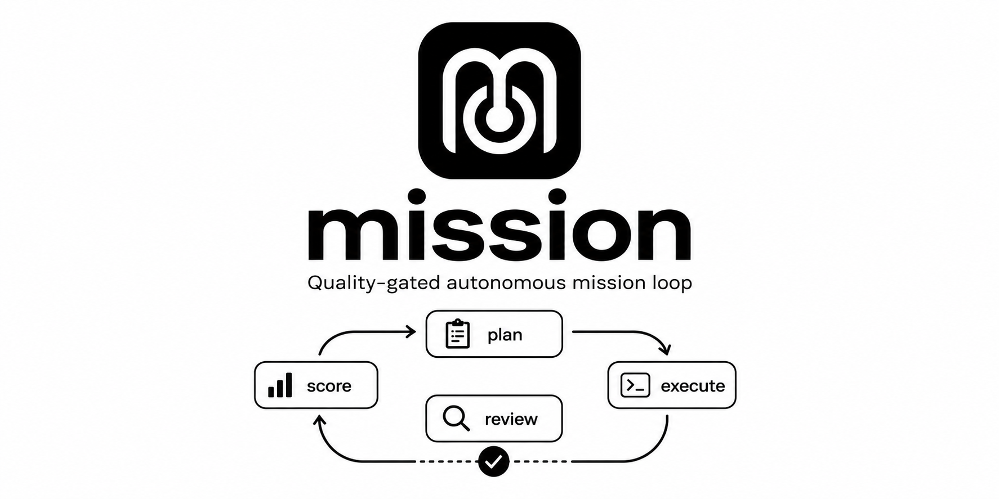

# mission

<p align="center">
  
</p>

**English** | [Japanese](README.ja.md)

`mission` is an OSS loop-engineering plugin for Claude Code and Codex. It keeps
agentic work moving until a recorded plan, reviewer evidence, an aggregated
score, and a state gate say the mission is actually done.

> Prompt engineering tells an agent what to do. Loop engineering defines how the
> agent keeps working until the job is actually done.

**The problem it solves is stopping too early** — not writing a better prompt.

---

## When to use `mission`

- Multi-step work where a single pass can ship something that *looks* finished:
  silent coverage gaps, summaries that do not reconcile with their own detail,
  sections promised in the text but never written.
- Irreversible production actions that must not run without human approval.
- Work spanning multiple sessions or context resets that needs resumable,
  auditable state.
- Environments where the *evidence for why the work was allowed to stop* is part
  of the deliverable.

## When **not** to use `mission`

- **You want a higher-quality artifact on average.** No quality advantage has
  been demonstrated. Measured cost is **5.4x wall-clock time and 4.9x notional
  spend** against a goal-only baseline. If your work resembles the 95% that
  passes the gate unchanged, a single careful pass gives you the same artifact
  faster.
- **Your task is simple and self-contained.** `mission` routes such work to the
  host's goal contract itself and does not even create mission state.
- **You want a PR-review bot, a development methodology, or a prompt replay
  loop.** Other tools do those better; see [Alternatives](#alternatives).

---

## How it works

```text
plan -> execute -> verify -> review -> aggregate score -> iterate
```

`mission` records a plan, executes it, records executed verification results,
collects structured reviewer output (`mission-review/1`), aggregates it into a
four-axis score with `aggregate-reviews`, records it with
`push-score --scoring-json`, and repeats until `mark-passes`
accepts the state or a halt condition fires. A Stop hook prevents the session
from ending while an active mission is still below the gate.

The pass gate is explicit:

```text
passes = findings_evidence_path exists
  AND evidence_high_count == open_high
  AND max_agreement_delta <= 1.5
  AND composite_score >= threshold
  AND min(scored_items) >= 3.5
  AND open_high == 0
```

For simple, low-risk, non-issue-bound work, `init` returns a routing verdict to
the host's goal contract and creates no state. Complexity, risk signals, and
`--issue-ref` decide this; `--force-mission` overrides it.

---

## What the evidence shows

This section separates what is **reproducible by you** from what is **operational
evidence from the maintainer's own repositories**. Read the limitations.

### Reproducible: paired benchmark vs a goal-only baseline

Protocol and raw data: [`benchmarks/mission-vs-goal/README.md`](benchmarks/mission-vs-goal/README.md).

| Measure | Result | Reading |
|---|---|---|
| Completion rate | goal 94.5% / mission 96.6% | Near parity. N is too small for a superiority claim. |
| Declared done but failed the validator | 0/120 goal, 0/114 mission | **No recorded case where the baseline failed and `mission` saved it.** |
| Wall-clock time | mission **5.4x** | Real cost, clean-condition measurement. |
| Notional spend | mission **4.9x** | Relative only. Under subscription execution there is no per-token charge; the consumed resource is the plan rate limit. |
| Second-iteration rate | 5.6% of mission runs | The review loop changes the artifact in a small minority of runs. |
| Quality | **not validly measured** | See below. |

**On quality, the honest statement is "not measured", not "tied".** The
benchmark's quality-marker scoring is structurally broken: a bare list of the
right keywords scores a perfect 1.00, while correct paraphrases — and correct
answers written in Japanese — score 0. Three independent reviews concluded that
regex co-occurrence cannot measure whether reasoning happened. **Do not cite the
current marker scores as evidence in either direction.** The replacement is
tracked in the repository's open issues.

### Operational: 451 scored production missions

Anonymized cases: [`docs/CASE_STUDIES.md`](docs/CASE_STUDIES.md).
**These come from the maintainer's private repositories and cannot be reproduced
from this repository.** They are disclosed with that limitation stated.

| Measure | Value | Reading |
|---|---:|---|
| Passed the gate at iteration 1 | 427 / 451 (95%) | For most work the loop is a pass-through: review cost, no change. |
| Scored below the gate at iteration 1 | 24 (5%) | The tail where the gate binds. |
| Multi-iteration missions | 44 | |
| — composite improved | 27 | e.g. 2.80 -> 4.20, 0.96 -> 4.80. |
| — composite unchanged | 15 | **Honest negative**: cost with no measured gain. |
| Halted for human approval | 7 | Production DB migrations, publishing a security audit, a production API cap change. |

**The distribution matters more than the average.** The gate earns its cost in a
minority tail, not by raising the mean.

### What this project does not claim

- That `mission` produces higher-quality artifacts on average.
- That `mission` completes work a goal-only baseline cannot. No such case is
  recorded.
- That the 5% tail rate transfers to your workload.
- That the current benchmark quality numbers mean anything.

These claims will be made only if and when pre-registered criteria are met
against a scoring method that can actually detect the difference.

### Cost control

To reduce review overhead for the 95% that passes unchanged, `mission` derives a
`review_tier` (light / standard / full) at init from complexity and mission text.
Light tier runs one reviewer instead of three and limits specialists to
`required: true` providers. **Gate semantics — threshold, open High findings,
agreement delta, halt conditions — are unchanged regardless of tier.**
The cost reduction effect has not yet been measured in production.

### Verified behavior

Dated verification snapshots, so a reader can tell how fresh each claim is.

- 2026-08-14: 3244 passed — full suite at the time of that snapshot. Run `make test` for the current count.
- Artifact support is implemented as a local Markdown artifact with explicit
  opt-in publish evidence; see [`docs/MISSION_ARTIFACTS.md`](docs/MISSION_ARTIFACTS.md).

---

## Security posture

### Implemented

- **Fail-closed Stop hook** — the session cannot end while an active mission is
  below the pass gate.
- **Lease / fencing with TTL** — mutating commands require a valid lease; stale
  and concurrent writes are rejected.
- **Irreversible-action halt gate** — irreversible operations halt pending
  explicit human approval; the reason is recorded verbatim in state.
- **Typed force-pass approval** — bypassing the gate requires a typed,
  content-addressed approval. Reviewer-aggregate evidence cannot be reused as a
  force-pass justification.
- **Provenance binding** — reviewer evidence and scores are sha256
  content-addressed, so a score cannot be re-pointed at different evidence.
- **Audit trail** — `scripts/mission-audit.py` classifies force-pass,
  specialist-provenance, and lease risks across recorded state (JSON/Markdown).
- **Permission preflight** — required permissions are checked at init and
  reported before work begins.

### Known gaps

These are open gaps, not planned features. Evaluate them before adopting
`mission` for high-stakes workflows. See [`SECURITY.md`](SECURITY.md).

- **No tamper-evidence signature on archived reviewer JSON.** Provenance binding
  protects evidence-to-score linkage, but archived review files carry no
  signature; filesystem-level tampering after archival is not detectable.
- **No identity binding for external specialist providers.** Invocations are
  recorded, but the executing provider's identity is not cryptographically bound
  to its output.
- **No blast-radius limits.** There is no enforced cap on how many files a
  mission may modify or which paths it may write.
- **Reviewers are not required to execute verification.** Verification tooling is
  available to reviewers, but reading-only review is possible. Executed
  verification results are now recorded separately so this can be measured.

### How it fails safe

| Condition | Behaviour |
|---|---|
| Stale or expired lease | Mutating command is rejected; state is not written. |
| Missing scoring evidence | `push-score` rejects the submission. |
| Score below the gate | Stop hook blocks session end; the loop continues. |
| Irreversible action detected | Halt fires and records the reason; work stays incomplete until a human resumes. |
| Unknown goal-dispatch configuration | Falls back to inline guidance without changing routing gates. |
| Offline or missing remote during local-authoring sync | Stops without stale fallback and without rewriting local work. |
| Force-pass without typed approval | Rejected. |

---

## Reproducing the evidence

Every command below is run from the repository root.

```bash
# 1. Full test suite, identical to CI
make test

# 2. Paired benchmark against the goal-only baseline.
#    NOTE: --max-budget-usd is a cutoff threshold on an estimated value,
#    not a billing cap. Under subscription execution the consumed resource
#    is your plan rate limit.
python3 benchmarks/mission-vs-goal/run_claude_goal_vs_mission.py \
  --starting-commit "$(git rev-parse HEAD)" \
  --tasks-file benchmarks/mission-vs-goal/tasks.tail.json \
  --run-id "$(date +%Y-%m-%d)-your-run" \
  --model-id <your-model-id> \
  --limit-tasks 5 \
  --repeats 3 \
  --stop-on-blocked

# 3. Audit mission state you have produced yourself
python3 scripts/mission-audit.py --root <path-to-your-project> --json
```

Comparative conclusions need `--repeats 3` or more: measured per-task variance
reached 0.51x-1.97x, so smaller differences are not distinguishable from noise.
The runner prints a warning and marks the summary when a run cannot support a
quality conclusion.

---

## Alternatives

| Choose | When |
|---|---|
| `mission` | You need an auditable completion gate, governance over irreversible actions, or resumable state, and the main risk is stopping too early. |
| Claude Code `/goal` | A lightweight run-until condition inside one session. No state machine, no reviewer loop. |
| `ralph-loop` | Re-run one prompt until a completion promise appears. Simpler, no scoring. |
| Superpowers | A broad coding-agent methodology: brainstorming, TDD, debugging, delivery. |
| Review / CI plugins | A specialist check on one part of the workflow; something else decides overall completion. |

Detailed comparison: [`docs/LOOP_ENGINEERING.md`](docs/LOOP_ENGINEERING.md).

---

## Installation

Set `MISSION_REPO` to the path where you want to clone this repository.

```bash
MISSION_REPO="$HOME/dev/mission"
git clone https://github.com/tackeyy/mission.git "$MISSION_REPO"
```

### Claude Code

Install through the local plugin marketplace entry:

```text
/plugin marketplace add ~/dev/mission
/plugin install mission@mission-marketplace
```

If you cloned to a different location, replace `~/dev/mission` with your
`$MISSION_REPO` path. `/plugin marketplace add` takes a literal path and does
not expand shell variables, so the path must match where you cloned.

The plugin install flow reads `.claude-plugin/plugin.json`, which points to
`claude-hooks/hooks.json`, and enables the Stop hook.

For regular use, prefer `/plugin install` over development-mode plugin loading.
In one verified run on 2026-06-14, development-mode loading did not expand
`${CLAUDE_PLUGIN_ROOT}` inside the model-visible skill text, which prevented the
orchestrator from finding `mission-state.py`.

If you already have a standalone `~/.claude/skills/mission` skill, move or remove
it before installing this plugin to avoid a name collision.

### Codex

For local authoring, Codex can use the skills by symlinking them into
`~/.codex/skills` and exporting the plugin root:

```bash
MISSION_REPO="$HOME/dev/mission"
for s in mission mission-planner mission-executor mission-reviewer mission-critic mission-scorer; do
  ln -sfn "$MISSION_REPO/skills/$s" "$HOME/.codex/skills/$s"
done
export MISSION_PLUGIN_ROOT="$MISSION_REPO"
export CLAUDE_PLUGIN_ROOT="$MISSION_REPO"  # Compatibility with current skill command text
```

Each local-authoring invocation runs `scripts/mission-local-authoring-sync.sh`
before mission state initialization. The guard fetches `origin/main`, updates only
a clean `main` checkout by fast-forward, verifies `HEAD == origin/main`, and then
requires the agent to reread the updated `SKILL.md`. Dirty, non-main, detached,
ahead/diverged, missing-remote, and offline states stop without stale fallback or
rewriting local work.

For plugin distribution, this repository also includes `.codex-plugin/plugin.json`
and `.agents/plugins/marketplace.json`. Codex marketplace installs use the
`plugins/mission/` wrapper because Codex expects marketplace entries to point at a
plugin folder under `plugins/`. The Codex plugin package is intentionally
skills-only by default; Stop hook installation is opt-in because Codex hook trust
and hook path resolution differ from Claude Code. See
[`skills/mission/refs/codex-setup.md`](skills/mission/refs/codex-setup.md) and
[`docs/DISTRIBUTION.md`](docs/DISTRIBUTION.md).

After `codex plugin add mission@mission-marketplace`, set `MISSION_PLUGIN_ROOT` to the
installed cache path and keep `CLAUDE_PLUGIN_ROOT` as a compatibility alias for
the current model-visible command text:

```bash
export MISSION_PLUGIN_ROOT="${CODEX_HOME:-$HOME/.codex}/plugins/cache/mission-marketplace/mission/2.8.0"
export CLAUDE_PLUGIN_ROOT="$MISSION_PLUGIN_ROOT"
```

Before marketplace submission, run through
[`docs/MARKETPLACE_RELEASE_CHECKLIST.md`](docs/MARKETPLACE_RELEASE_CHECKLIST.md).

## Usage

```text
/mission <mission description> [--max-iter N] [--skip-preflight] [--threshold X] [--budget-minutes N] [--goal-dispatch <inline|host-native>] [--force-mission]
```

The orchestrator records assumptions, decomposes the mission, executes work,
collects reviewer JSON, runs `aggregate-reviews`, records the result with
`push-score --scoring-json`, and repeats until `mark-passes` accepts the state or
a halt condition is reached. An explicitly user-supplied manual score must first
pass `manual-score-capture`; it is a typed, content-addressed import and does
not reuse reviewer-aggregate evidence. See [`skills/mission/SKILL.md`](skills/mission/SKILL.md)
for the execution protocol and [`docs/PASS_RATE_METRICS.md`](docs/PASS_RATE_METRICS.md)
for the `stats`/audit raw, completed, role-aware, and terminal-outcome quality schema. Reusable, explicit-only
audit/stats state snapshots are documented in
[`docs/STATE_SNAPSHOTS.md`](docs/STATE_SNAPSHOTS.md).

`--goal-dispatch` selects inline or host-native goal guidance after Simple
routing, and `--force-mission` keeps the mission loop active even when a Simple
task would normally route to goal.

## Requirements

- macOS or Linux
- Python 3.9 or later
- `jq` for the Stop hook
- Claude Code or Codex for skill execution

Windows is not supported because `skills/mission/bin/mission-state.py` depends on
Unix-only file locking through `fcntl`.

The Stop hook's stale-state warning parses timestamps with BSD `date` on macOS
and GNU `date` on Linux, so it works on both. It degrades silently only if both
parsers fail; the core blocking behavior always works.

## Configuration

| Environment variable | Default | Purpose |
|---|---|---|
| `MISSION_PLUGIN_ROOT` | unset | Agent-neutral plugin root used by Codex/local installs |
| `CLAUDE_PLUGIN_ROOT` | unset | Compatibility alias for existing model-visible command text and Claude Code hook paths |
| `MISSION_SEARCH_ROOTS` | current directory | Search roots for `list`, `cleanup-stale`, `stats`, and `halt --all` |
| `MISSION_LEASE_ID` | unset | Explicit fencing token for mutating commands; lease-free legacy state may acquire one on first write |
| `MISSION_LEASE_TTL_SECONDS` | `900` | Lease TTL in seconds for mutating commands; `supersede-reviews` requires old review-session leases to be expired and fails with `lease-rejected` without writing while any remain live |
| `MISSION_OPERATION_ID` | unset | Caller-stable retry ID required by v5 `planning reselect` and `supersede-reviews`; reuse it only for an exact retry and issue a new ID for a new invocation |
| `MISSION_SESSION_ID` | unset | Explicit session ID; falls back to `CLAUDE_CODE_SESSION_ID`, `CODEX_THREAD_ID`, then pid |
| `MISSION_STALE_ACTIVE_SECONDS` | `10800` | Active-state staleness threshold in seconds |
| `MISSION_SKILL_ROOTS` | unset | Additional skill roots searched before the default `~/.codex/skills` and `~/.claude/skills` |
| `MISSION_REQUIRE_SCORING_EVIDENCE` | unset | Scoring-evidence gate for `push-score`; set `0` only for the deprecated escape hatch |

`MISSION_SEARCH_ROOTS` accepts multiple paths separated by the platform path
separator, for example `~/workspace:~/dev` on macOS/Linux.

## Testing

```bash
make test-smoke   # syntax/import check, no install required
make test         # CI-identical full suite
make test-shard   # one CI shard
```

## Repository Layout

| Path | Purpose |
|---|---|
| `skills/mission/` | Main orchestrator skill, state CLI, references, and tests |
| `skills/mission-planner/` | Planning subskill |
| `skills/mission-executor/` | Execution subskill |
| `skills/mission-reviewer/` | Peer-review subskill |
| `skills/mission-critic/` | Iteration-improvement subskill |
| `skills/mission-scorer/` | Fallback prose-to-JSON converter for reviewer output |
| `docs/` | Design and operations documentation |
| `benchmarks/` | Mission-vs-goal pilot measurements |
| `scripts/mission-local-authoring-sync.sh` | Fail-closed latest-main bootstrap for Git-backed local authoring |
| `scripts/ci_changed_scopes.js` | CI changed-scope detector |
| `scripts/mission-stop-guard.sh` | Stop hook used to keep active missions running |
| `claude-hooks/hooks.json` | Claude Code Stop hook declaration |
| `.claude-plugin/` | Claude Code plugin metadata and marketplace manifest |
| `.codex-plugin/` | Codex plugin metadata |
| `.agents/plugins/` | Codex local marketplace metadata |
| `plugins/mission/` | Codex marketplace plugin wrapper |

## Documentation

| Path | Purpose |
|---|---|
| [`skills/mission/SKILL.md`](skills/mission/SKILL.md) | Execution protocol |
| [`docs/LOOP_ENGINEERING.md`](docs/LOOP_ENGINEERING.md) | Positioning and comparison |
| [`docs/CASE_STUDIES.md`](docs/CASE_STUDIES.md) | Operational evidence (not independently reproducible) |
| [`benchmarks/mission-vs-goal/`](benchmarks/mission-vs-goal/) | Reproducible benchmark protocol and raw data |
| [`docs/MISSION_ARTIFACTS.md`](docs/MISSION_ARTIFACTS.md) | Local-first artifact contract |
| [`docs/PASS_RATE_METRICS.md`](docs/PASS_RATE_METRICS.md) | Pass-rate and audit metric schema |
| [`docs/STATE_SNAPSHOTS.md`](docs/STATE_SNAPSHOTS.md) | Audit/stats state snapshots |
| [`docs/DISTRIBUTION.md`](docs/DISTRIBUTION.md) | Distribution and packaging |
| [`SECURITY.md`](SECURITY.md) | Security policy and reporting |
| [`CONTRIBUTING.md`](CONTRIBUTING.md) | Contribution guidelines |

## Contributing

Contributions are welcome. Please read [CONTRIBUTING.md](CONTRIBUTING.md),
[docs/TESTING.md](docs/TESTING.md), and [SECURITY.md](SECURITY.md) before
opening issues or pull requests.

We recognize code, documentation, tests, issue reports, ideas, reviews, and
feedback as contributions.

### Contributors

<!-- CONTRIBUTORS-START -->
<a href="https://github.com/tackeyy"></a>
<a href="https://github.com/shurijoc"></a>
<!-- CONTRIBUTORS-END -->

## License

MIT. See [`LICENSE`](LICENSE).
